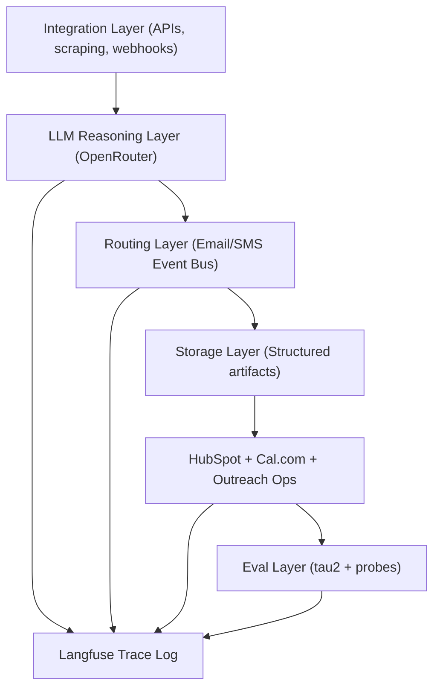

# Conversion Engine (Tenacious)

Production-grade B2B lead conversion system with LLM-orchestrated enrichment, bidirectional outreach handling, CRM/calendar linkage, and evaluation.

## Architecture



## Repository Layout

Implements the required layout under the `agent/`, `pipelines/`, `integrations/`, `eval/`, `data/`, and `config/` modules.

## Setup

1. Create env and install:

```bash
python -m venv .venv
source .venv/bin/activate  # on Windows: .venv\\Scripts\\activate
pip install -r requirements.txt
cp .env.example .env
```

2. Run interim mode:

```bash
python main.py --mode interim
```

3. Run final mode (includes probes):

```bash
python main.py --mode final
```

4. Run API:

```bash
uvicorn main:app --reload
```

## API Endpoints

- `GET /health`
- `POST /run/interim`
- `POST /run/final`
- `GET /traces`
- `POST /webhooks/email`
- `POST /webhooks/sms`

## Interim Submission Coverage

- Data ingestion
- Signal generation with confidence/source/timestamp
- ICP classification + abstention
- One full email generation and validation
- CRM sync (HubSpot sandbox client)
- tau2 benchmark baseline
- Langfuse-style trace logs (`trace_log.json`)

## Final Submission Coverage

- 30-probe adversarial suite
- failure taxonomy
- held-out eval with CI + pass@1
- cost tracking

## Determinism and Grounding

- Uses only structured input files in `data/`
- No fabricated external data
- Deterministic scoring functions for same input
- Guardrails prevent over-claims and unsupported assertions

## Mock Data Generator

```bash
python scripts/generate_mock_data.py
```

## Evaluation Runners

```bash
python scripts/run_eval.py
python scripts/system_memo.py
```
